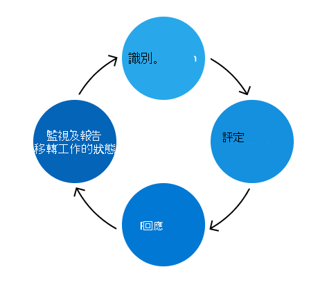

# Microsoft 365風險管理計劃Microsoft 365 Risk Management program

Microsoft 365 風險管理計劃的目的在於識別、評估和管理 Microsoft 365 風險。The purpose of the Microsoft 365 Risk Management program is to identify, assess, and manage risks to Microsoft 365. Microsoft 365 的優先順序是符合合約義務和資格鑒定、增加客戶信任，以及維護我們的競爭優勢。Microsoft 365's priority is to meet contractual obligations and accreditations, increase customer trust, and maintain our competitive edge. 雖然 Microsoft 365 風險管理計劃個別運作，但是會將其與最相符的 Enterprise 風險管理 (ERM) 計畫的原則、優先順序及方法。While the Microsoft 365 Risk Management program functions independently, it aligns with the overarching Enterprise Risk Management (ERM) program's policies, priorities, and methodologies. 使用 ERM 計畫，可在不同的商業單位和工程群組中進行一致的比較，對整個企業中的風險管理造成更為內聚的方法。Working with the ERM program allows for consistent comparison across business units and engineering groups, contributing to a more cohesive approach to risk management across the enterprise.

Microsoft 365 信任小組負責管理 Microsoft 365 風險管理計劃，並執行 ERM 計畫所展示的活動。The Microsoft 365 Trust team is responsible for managing the Microsoft 365 Risk Management program and conducting the activities laid out by the ERM program. 信任小組著重于整合風險管理架構與現有的 Microsoft 365 工程、服務作業及規範程式，讓風險管理計劃更有效率且更有效率。The Trust team focuses on integrating the risk management framework with existing Microsoft 365 engineering, service operations, and compliance process to make the Risk Management program more effective and efficient.

信任小組也會維護 Microsoft 365 控制架構，這是一組合理化的控制項，在使用支援的合規性活動適當實施時，可讓工程小組遵守重要的規章和認證。The Trust team also maintains the Microsoft 365 Controls Framework, a set of rationalized controls that, when properly implemented with supporting compliance activities, allows engineering teams to comply with key regulations and certifications. 這個架構會隨著風險管理程式的一部分，持續更新，以反映意見反應和結果。This framework is continuously updated based on feedback and findings as part of the risk management process.

風險管理活動分為四個階段：「識別」、「評估」、「回應」和「監控」和「報告」。Risk management activities fall into four phases: identification, assessment, response, and monitoring and reporting.

## 識別Identification

風險管理程式開始找出所有可能的風險，以找出 Microsoft 365 環境中的所有主要控制區域、內部和外部威脅及弱點。The risk management process starts with identifying all possible risks to all key control areas, internal and external threats, and vulnerabilities in the Microsoft 365 environment. 此程式的資訊指導來自多個來源，包括採訪、弱點掃描、攻擊類比練習、審核結果和事件管理活動。The information guiding this process comes from multiple sources including interviews, vulnerability scans, attack simulation exercises, audit findings, and incident management activities.

信任小組採訪從多個服務小組 (Sme) 的主題專家，以及可能隨著服務成長而引進的潛在未來風險。The Trust team interviews subject matter experts (SMEs) from multiple service teams on previously identified risks and potential future risks that may be introduced as the services grow. 此外，Sme 也可協助您驗證從其他連續監控來源識別之風險的準確性和完整性。Additionally, SMEs help to validate the accuracy and completeness of risks identified from the other continuous monitoring sources.

識別階段也會檢查決策記錄、作用中的安全性和符合性例外狀況，以及先前風險評估的緩解工作。The identification phase is also when decision logs, active security and compliance exceptions, and mitigation work from previous risk assessments are reviewed.

## 評估Assessment

每個識別的風險都會使用三個計量法評估：影響、可能性及控制缺陷。Each identified risk is assessed using three metrics: impact, likelihood, and control deficiency.

- 影響指的是對服務、業務或 Microsoft 所造成的損毀，如果已實現此風險。Impact refers to the damage that would occur to the service, business, or Microsoft if that risk were to be realized. 對 Microsoft 的影響可能包括對信譽的損毀、客戶損毀，或法律/法規遵從性的影響。The impact to Microsoft may include damage to reputation, loss of customers, or legal/compliance implications.
- 可能性會定義已實現潛在風險的可能性，並透過分析其發生的概率及頻率來進行計算。Likelihood defines the probability of the potential risk being realized and is calculated by analyzing the probability and frequency with which it will occur.
- 控制缺陷衡量實施的緩解控制措施的效能。Control deficiency measures the effectiveness of implemented mitigation controls.

這些計量值是用來計算風險評分，表示每個風險的嚴重性（包括現有的緩解策略）。These metrics are used to calculate a risk score that represents the severity of each risk, accounting for existing mitigation strategies. 會匯總風險並將其呈現給每項服務的重要專案關係人，以驗證 Microsoft 365 風險狀況的準確性和完整性。Risks are aggregated and presented to key stakeholders from each service to verify the accuracy and completeness of Microsoft 365's risk posture.

## 回應Response

信任小組使用已驗證的風險清單來 Microsoft 365，將風險指派給受影響的服務，以進行風險回應。Using the verified list of risks to Microsoft 365, the Trust team assigns risks to the affected service for risk response. 定義的指導方針可協助根據風險分數和控制效能，判斷適當的風險回應策略。Defined guidelines help determine the appropriate risk response strategy based on the risk score and control effectiveness. 風險回應策略分為四個類別：Risk response strategies fall into four categories:

- 容忍：具有低程度控制的低風險風險區域。Tolerate: Areas of low-risk exposure with a low level of control.
- 運作：低風險曝光區中的控制項被視為適當的地方。Operate: Areas of low-risk exposure where controls are deemed adequate.
- 監視：高風險曝光區，其中的控制項被視為適當，應加以監控以獲得有效的效能。Monitor: Areas of high-risk exposure where controls are deemed adequate and should be monitored for effectiveness.
- 改進：高風險曝光區，具有最低的控制層級，也就是定址的頭等大事。Improve: Areas of high-risk exposure with a low level of control that are top priorities in addressing.

信任團隊會與服務小組協調，以制定解決每項風險的計畫。The Trust team coordinates with service teams to develop plans for addressing each risk. 嚴重性層級決定每個計畫的適當檢查和核准層級。The severity level determines the appropriate level of review and approval for each plan. 針對需要採取動作的風險，現有的工程程式錯誤處理常式可用於追蹤、管理及作出例外決定。For risks that require action, existing engineering bug processes are used for tracking, managing, and making exception decisions. 使用工程和作業團隊所熟悉的程式，可使風險回應更有效率且有效。Using a process familiar to the engineering and operation teams makes risk response more efficient and effective.

## 監視與報告Monitoring and reporting

在風險評估中識別出的風險會受到監控並報告給相關的專案關係人。Risks identified as part of the risk assessment are monitored and reported to relevant stakeholders. 監視策略包括安全性監控、定期風險檢查、滲透測試及弱點掃描。Monitoring strategies include security monitoring, periodic risk reviews, penetration testing, and vulnerability scanning. 這些監控工作是做為報告重要效能指標、建立儀表板及開發正式報告的資料來源，其全部都是對未來風險決策的通知。These monitoring efforts act as data sources for reporting on key performance indicators, creating dashboards, and developing formal reports, all of which inform future risk decisions.

一年多次，信任團隊會與每項服務的風險擁有者開會，以查看風險分數、評估其行動計畫的有效性，以及在所需的位置進行更新。Multiple times a year, the Trust team meets with risk owners from each service to review risk scores, evaluate the effectiveness of their action plans, and make updates where needed. 此外，Microsoft 365 的風險評估活動可對 ERM 計畫的 Enterprise 風險評估做貢獻，其可提供 microsoft 高層管理和 ERM 計畫的 microsoft 風險狀態的高層次概述。In addition, Microsoft 365's risk assessment activities contribute to the ERM program's Enterprise Risk Assessments, which provide a high-level overview of Microsoft's risk posture to Microsoft senior management and the ERM program.
